<!--
  BEFORE YOU PUSH THIS: change the two links below to your real site address.
  Search this file for "abeer-sajid.github.io/recruiter-simulator" and replace it.
  There are 4 places. That is the only edit this file needs.
-->

<h1 align="center">Recruiter Simulator 2026</h1>

<p align="center">
  <b>My portfolio is a small video game. You play as the recruiter.</b><br>
  Walk around an office. Each room is a part of my CV. The last boss is a job application form.
</p>

<p align="center">
  <a href="https://abeer-sajid.github.io/recruiter-simulator/"><b>▶ Play it</b></a>
  &nbsp;·&nbsp;
  <a href="https://abeer-sajid.github.io/recruiter-simulator/resume/"><b>📄 Just read my resume</b></a>
  &nbsp;·&nbsp;
  <a href="mailto:abrsjd5@gmail.com"><b>✉ Email me</b></a>
</p>

<p align="center">
  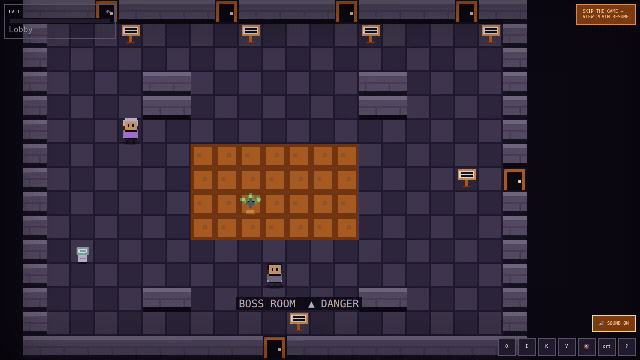
</p>

<p align="center">
  <i>Short on time? There is a <b>"Skip the game — view plain resume"</b> button on every single screen.</i><br>
  <a href="docs/media/demo.mp4">Watch the longer video (80 seconds)</a>
</p>

---

## What is this?

I'm Abeer. I worked for two years as a Production Support Engineer, keeping a
healthcare payment system running and fixing it when it broke at 3am. I also
build small AI tools in Python.

A CV in a PDF gets about eight seconds of attention, and it doesn't really show
whether someone can build things. So I built this instead.

You play a recruiter who has been given a ticket: *evaluate Abeer Sajid*. You
walk around the office and find things out:

| Room | What's in it |
|---|---|
| 🪴 **Lobby** | A talking office plant called Ficus explains the controls. He gets more worried the longer you wander. |
| 🕹️ **Hall of Projects** | One arcade machine per project. Walk up, press E, read the card. |
| 💎 **Skill Tree Chamber** | My skills as a game stat sheet, level 1–99. The numbers are honest, including the low ones. |
| 🗄️ **The Archives** | A corridor of my past jobs. An old colleague stands in each doorway and tells you what I was like. |
| ☕ **Break Room** | The human bit. Coffee machine, bookshelf of certificates, and one short paragraph where I stop joking. |
| 📋 **Boss Room** | A giant job application form with a health bar. You beat it by sending me a real message. |

There's also a secret room. You'll find it if you explore enough.

---

## Take a look

<table>
  <tr>
    <td width="50%">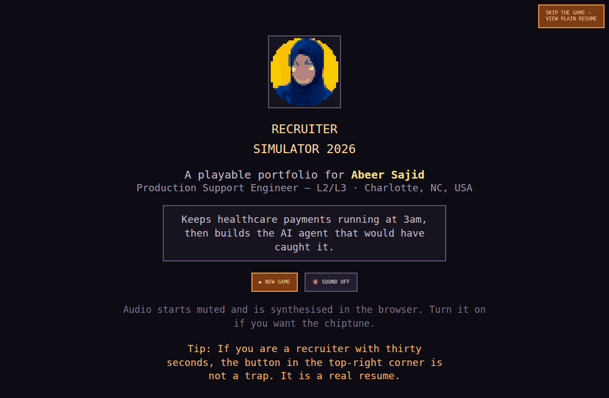<br><b>Title screen</b><br>Continue or start fresh. Sound is off until you turn it on.</td>
    <td width="50%">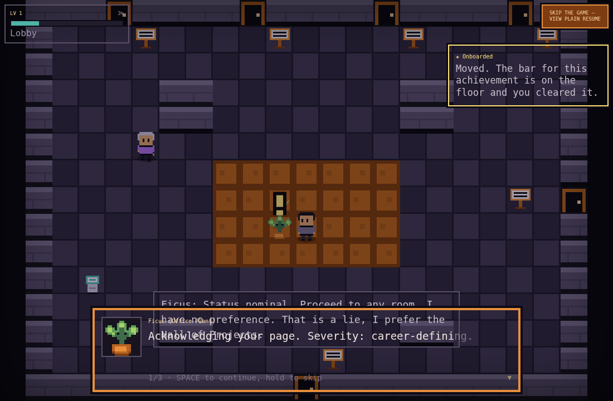<br><b>Ficus, the office plant</b><br>He narrates the whole game and speaks in incident-report language.</td>
  </tr>
  <tr>
    <td>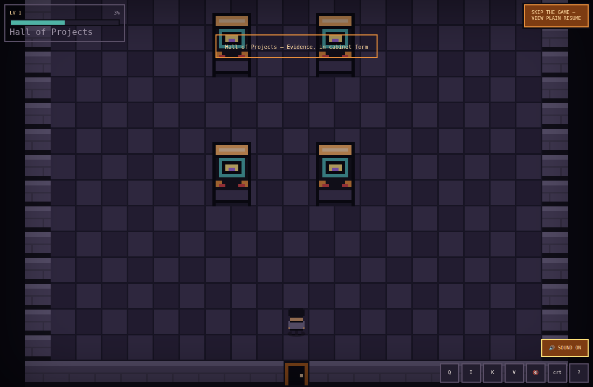<br><b>Hall of Projects</b><br>One arcade machine per project. Add a project and a new machine appears by itself.</td>
    <td>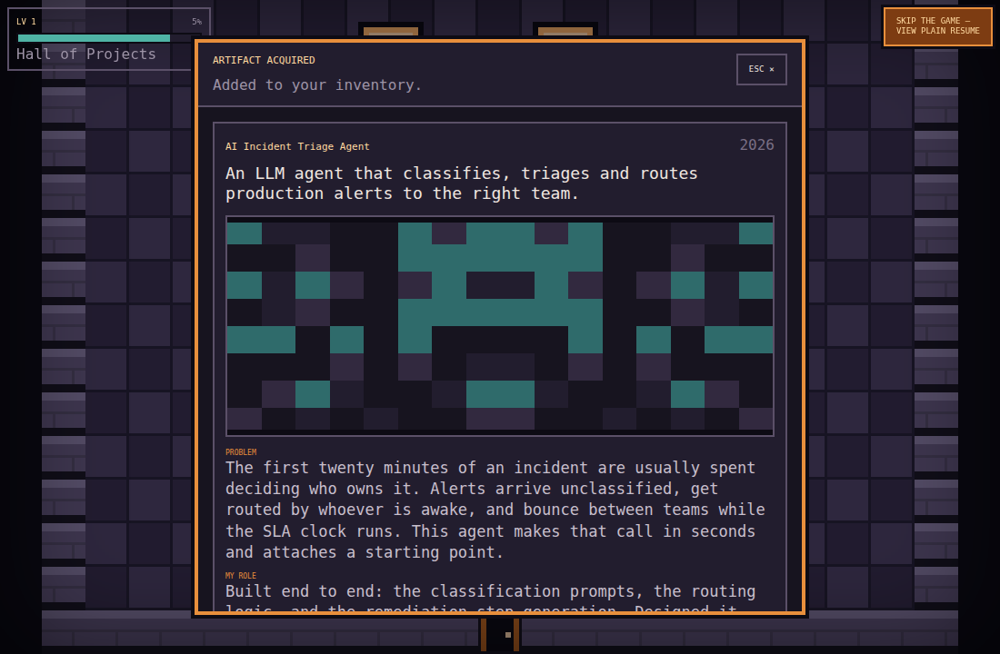<br><b>A project card</b><br>What it does, what problem it solved, what I built, and the interesting technical bit.</td>
  </tr>
  <tr>
    <td>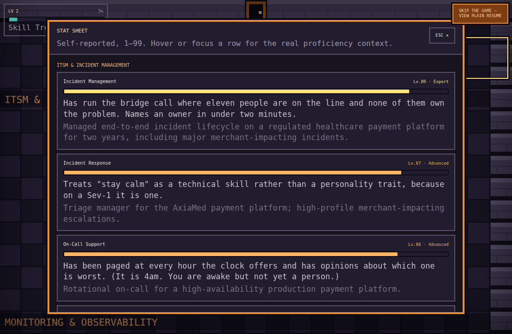<br><b>The stat sheet</b><br>Every skill has a level and a one-line honest description. CSS is a 64.</td>
    <td>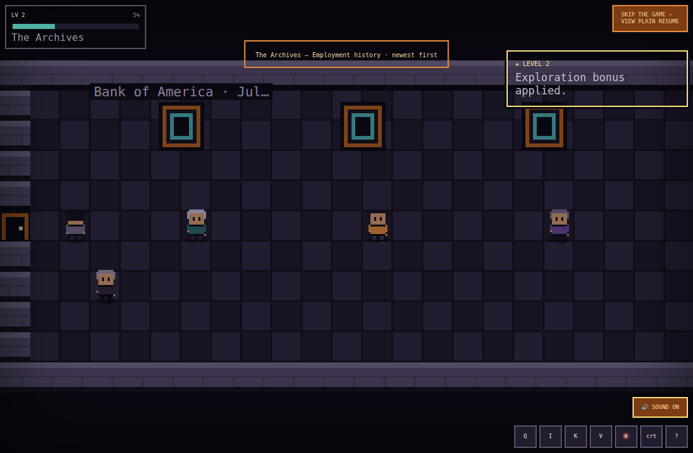<br><b>The Archives</b><br>Walk left to right through my work history and talk to former colleagues.</td>
  </tr>
  <tr>
    <td>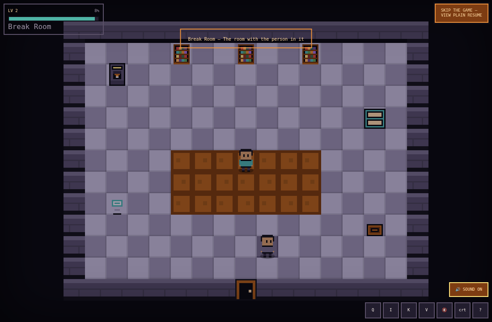<br><b>Break Room</b><br>Hobbies, certificates, and the one sincere paragraph in the building.</td>
    <td>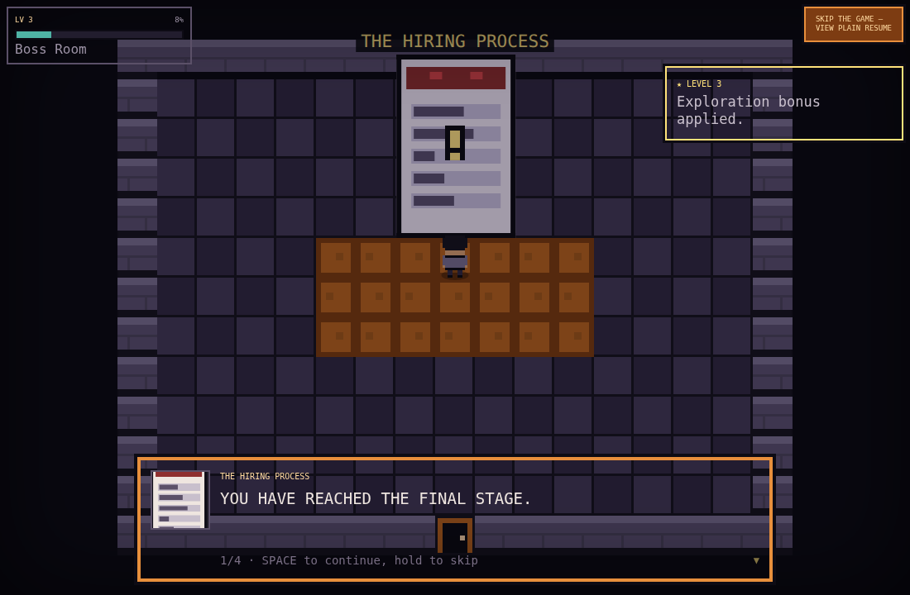<br><b>THE HIRING PROCESS</b><br>The final boss. It has a health bar. It asks you to re-enter information it already has.</td>
  </tr>
  <tr>
    <td>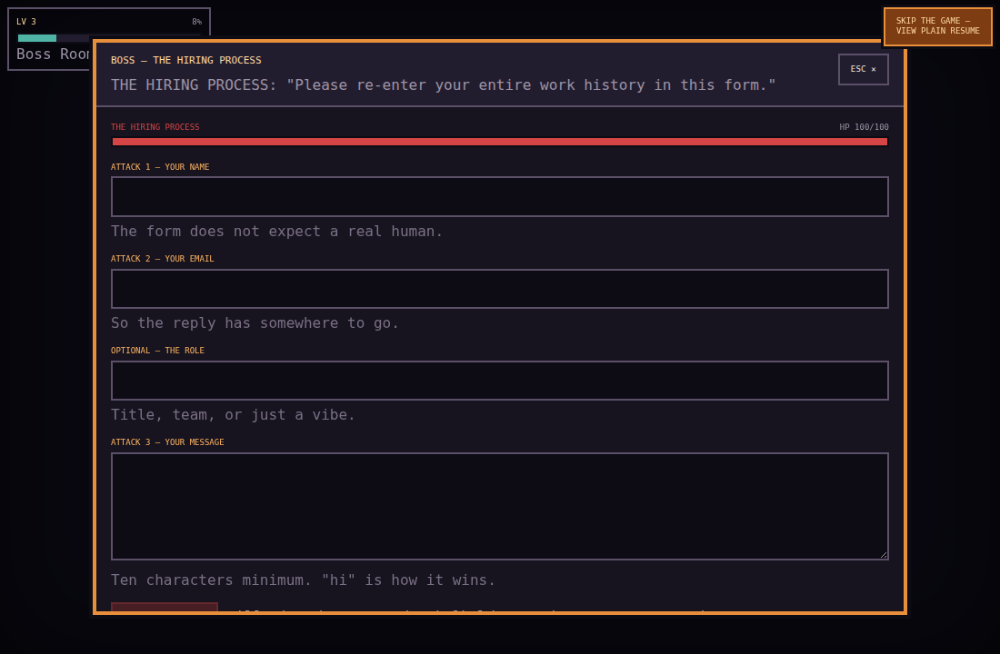<br><b>The contact form</b><br>Filling each field hits the boss. Sending the message beats it. The message really arrives.</td>
    <td>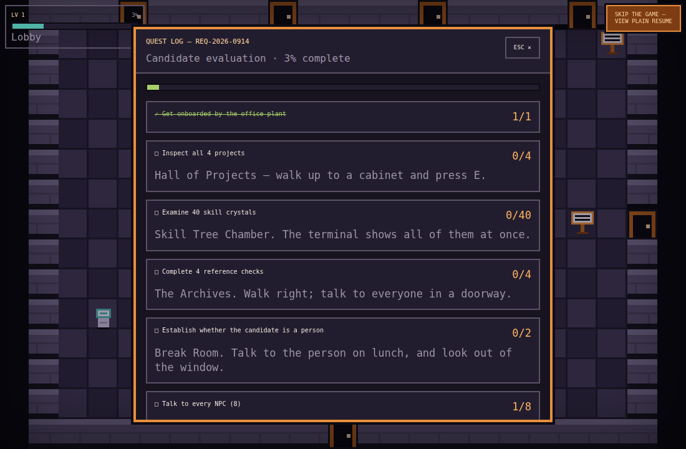<br><b>Quest log</b><br>Press Q. The list writes itself from my data — it always says the right number.</td>
  </tr>
  <tr>
    <td>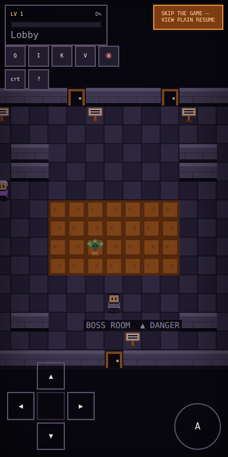<br><b>On a phone</b><br>You get a D-pad and an A button. Small screens are also offered the plain resume first.</td>
    <td>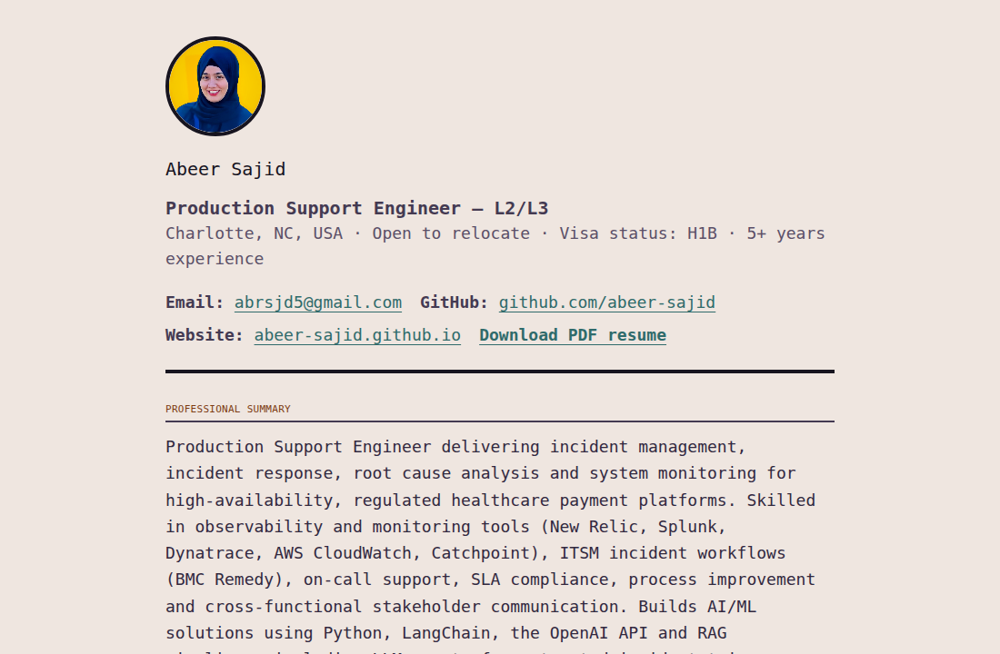<br><b>The plain resume</b><br>One click from anywhere. Loads instantly, works with screen readers, no game needed.</td>
  </tr>
</table>

---

## How to play

Nothing to install. It runs in your browser.

| Key | What it does |
|---|---|
| **W A S D** or **arrow keys** | Walk |
| **E** or **Space** | Talk to things, turn the page (hold it down to go faster) |
| **1 2 3** | Pick a reply |
| **Q** | Quest log |
| **I** | Inventory |
| **K** | Skill stat sheet |
| **V** | Achievements |
| **M** | Sound on / off |
| **C** | Old-TV scanline filter |
| **?** | Show all the keys |
| **Esc** | Close anything |

On a phone, buttons appear on the screen. You don't need a keyboard.

There are 18 achievements. Some are easy. Some are silly — try using the coffee
machine ten times, or standing completely still for a minute.

---

## Run it on your own computer

You need [Node.js](https://nodejs.org) (version 18 or newer). Then:

```bash
git clone https://github.com/abeer-sajid/recruiter-simulator.git
cd recruiter-simulator
npm install
npm run dev
```

Open the link it prints (usually `http://localhost:5173`). That's it.

Other useful commands:

| Command | What it does |
|---|---|
| `npm run dev` | Play it while you edit. The page reloads when you save. |
| `npm run build` | Make the finished version in the `dist` folder. |
| `npm run check:content` | Check my content files for mistakes and print every room's size. |
| `npm run check:size` | Show how big the download is. |

---

## Changing what's inside it

**All of my content lives in one folder: `src/data`.** Nothing else needs to be
touched. Not the game code, not the maps, not the positions of anything.

```
src/data/
  profile.ts       name, links, education, certificates
  projects.ts      one arcade machine each
  skills.ts        one crystal each
  experience.ts    one doorway + one old colleague each
  dialogue.ts      everything anyone says
  achievements.ts  the pop-up rewards
  jokes.ts         loading tips and NPC one-liners
  palette.ts       all 24 colours
```

Here's the nice part. If I paste a new project into `projects.ts`:

- a new arcade machine appears in the Hall of Projects
- the room re-arranges itself and gets bigger
- the quest changes from "Inspect all 4 projects" to "Inspect all 5 projects"
- the inventory gets a new slot
- the completion percentage updates
- the project appears on the plain resume page

…and the game checks that you can still walk to everything in the room. I never
edit a map by hand.


---

## How it's built

- **React 18, TypeScript, Vite, Zustand, Tailwind CSS**
- The world is drawn on an HTML canvas. All the menus and text are normal web
  elements, so you can select the text and screen readers can read it.
- **No game engine.** The movement, walls, camera, dialogue and save system are
  about 4,000 lines I wrote myself. A game engine would have made the download
  three times bigger for things this game doesn't need.
- **No picture files.** Every character and object is a small grid of letters in
  a data file, drawn by code. My photo is the one exception, and it's also
  turned into pixel art by a script.
- **No sound files.** The beeps and the level-up jingle are made by the browser
  as you play.
- **96 KB** to download (compressed). Most websites are much bigger than that.

### Why bother with all that

Recruiters are often on a phone with bad signal and thirty seconds to spare. A
heavy site would waste both. And the whole point of this project is to show that
I build things carefully, so a slow, bloated portfolio would have proved the
opposite.

---

## Is it actually tested?

Yes. `node scripts/playtest.mjs` opens the finished game in a real browser with
no window, plays it, and checks 25 things:

walking · bumping into walls · talking to a character · dialogue choices ·
going through a door · picking up a project · the boss losing health when you
fill in the form · saving and coming back · an old save still working after I
add new content · a broken save not crashing anything · the resume page ·
the phone controls.

It also saves a screenshot of every room to a `playtest` folder. Every picture
in this README came from that.

Those tests found four real bugs before anyone else saw them.

---

## Things that matter to me in this project

- There is always a way out to the plain resume. It's on every screen,
  including the very first one.
- My contact details are never locked behind the game. They're on the title
  screen, in the boss room, in the credits, and on the resume page.
- Sound never plays until you ask for it.
- If you have "reduce motion" turned on, the shaking and bouncing stop.
- You can play the whole thing with just a keyboard.
- Your progress is saved. Come back next week and it remembers.

---

## License

The **code** is MIT licensed — see [LICENSE](./LICENSE). Take the engine, the
content system, the dialogue system, whatever is useful, and build your own.

The **content** is mine: my name, photo, resume text, job history and the
writing in `src/data`. Please replace all of it with your own if you fork this.
